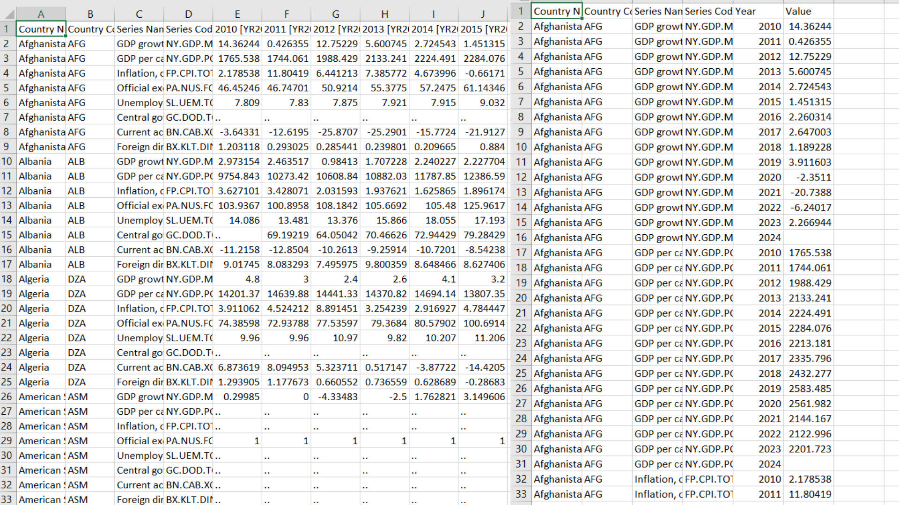
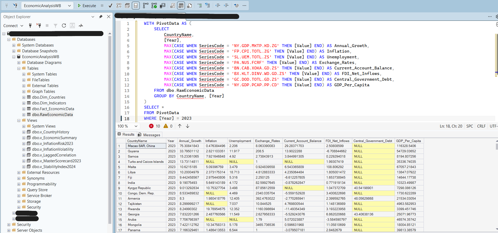
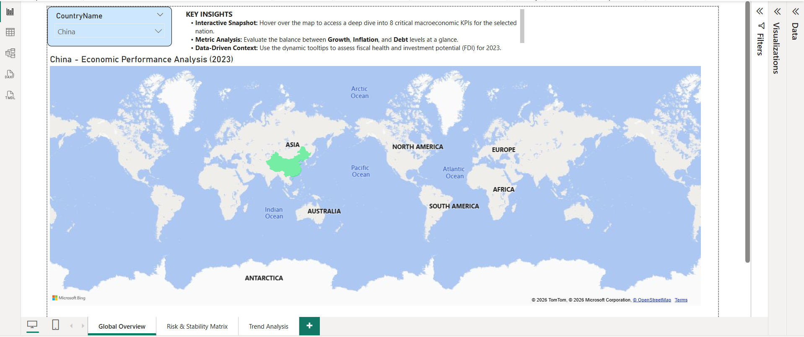
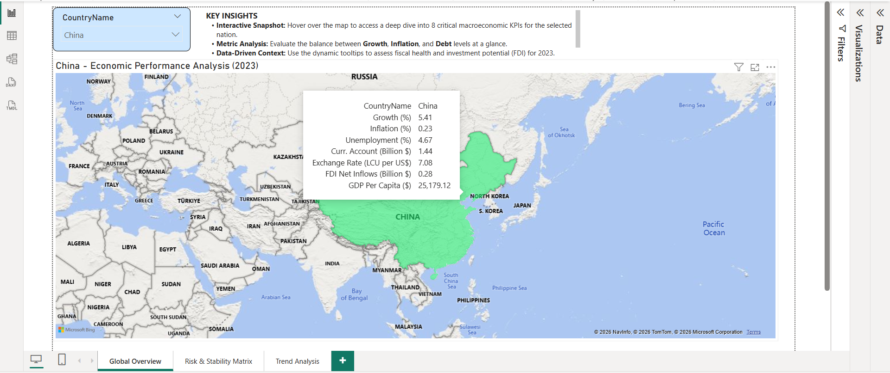
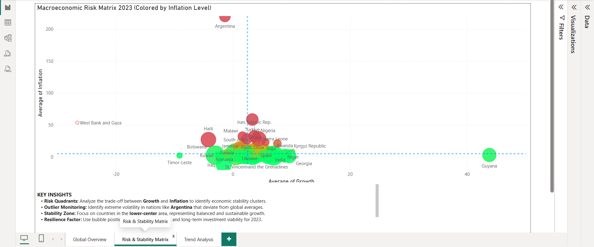

# 📊 Strategic Macroeconomic Analysis: An End-to-End Study
### *Bridging Data Management and Economic Insights (2010-2024)*

## 🌍 Project Summary
This project demonstrates an end-to-end data analytics workflow, transforming raw World Bank data into an interactive Business Intelligence solution. By integrating **Excel** for preprocessing, **SQL Server** for advanced data modeling, and **Power BI** for dynamic visualization, the dashboard provides a deep dive into global economic stability and risk assessment.

## 🛠 The Data Journey (Step-by-Step)

### 1. Data Engineering & Cleansing (Excel)
* **Preprocessing:** Cleaned and structured a dataset of **26,000+ records** to ensure data integrity.
* **Normalization:** Transformed raw World Bank indicators into a tabular format ready for SQL migration.

### 2. Analytical Modeling & SQL Logic
* **Smart Data Sourcing:** Built custom **SQL Views** (`v_CountryHistory`, `v_MasterScorecard2023`) to serve as the high-performance backbone for the dashboard.
* **Business Logic Layer:** Moved complex calculations from the reporting layer to the SQL layer to optimize speed and maintainability.

### 3. Interactive Dashboard (Power BI)
* **Dynamic Selection:** The entire report and its titles update instantly when you select a country.
* **Country Scorecards:** Hovering over the map shows a pop-up with **8 key economic indicators** for any nation.
* **Risk Mapping:** Countries are automatically grouped into "Stable" or "High Risk" zones based on their inflation and growth.
* **Trend Tracking:** A single chart compares Growth and Inflation trends from 2010 to 2024 to show historical patterns.

---
**Technical Stack:** SQL Server, Power BI (DAX & Power Query), Microsoft Excel.

### 📊 Data Journey: From Raw to Insights

*Figure 1: Comparison between multi-layered raw World Bank data and the final structured dataset ready for analysis.*

### 💻 SQL Modeling & Pivot Logic

*Figure 2: Advanced SQL query using CTEs and CASE statements to pivot 8 different economic indicators into a single view.*

### 📈 Power BI Interactive Solution

*Figure 3: Main dashboard view featuring dynamic titles and automated filtering based on country selection.*

*Figure 4: Custom report-page tooltip providing an instant 8-KPI "Economic Scorecard" for any nation on the map.*

*Figure 5: Macroeconomic Risk Matrix (Quadrant Analysis) used to categorize countries by Inflation and Growth stability.*
